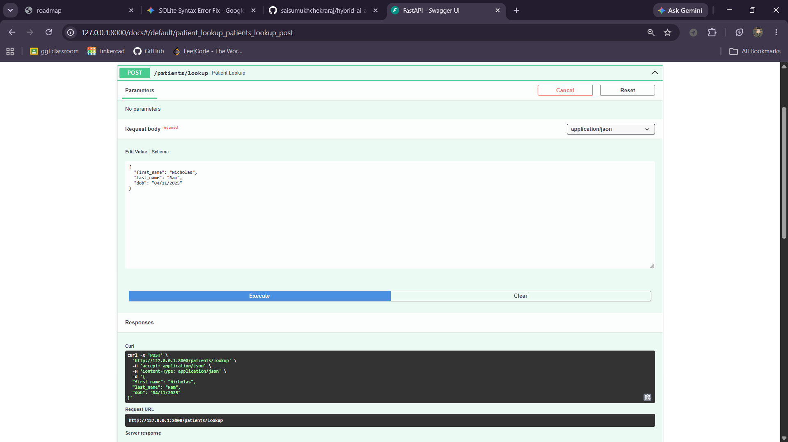
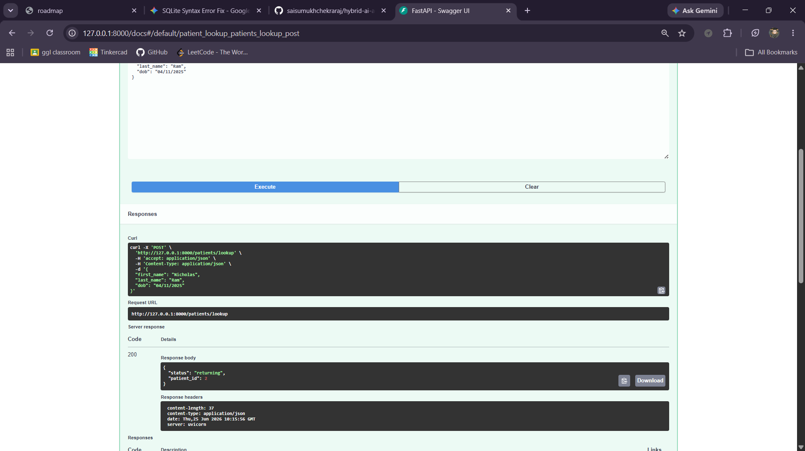
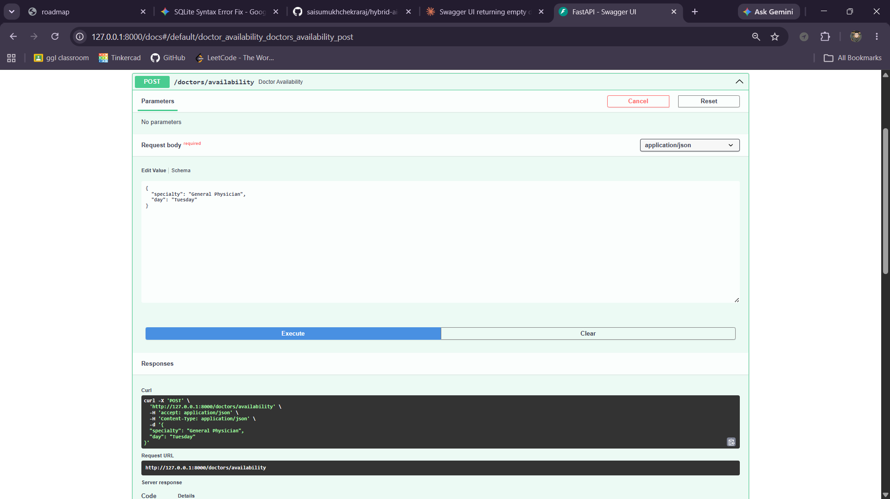
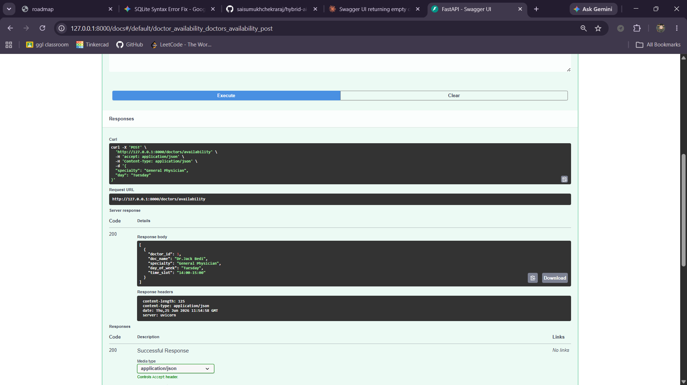
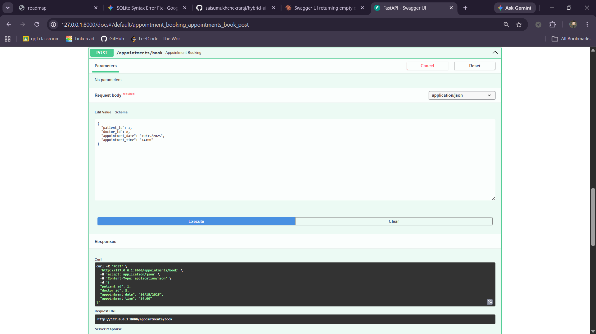
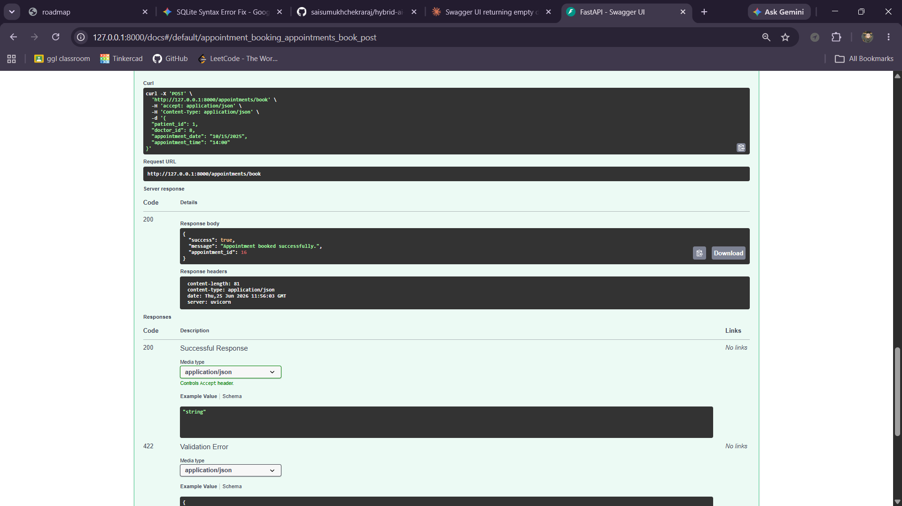
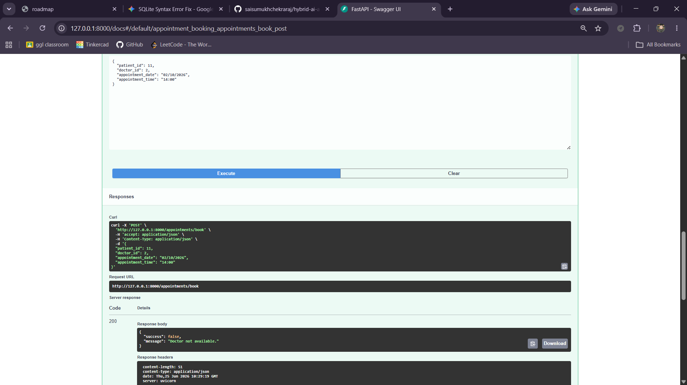

# Hybrid AI Agent

A Hybrid Intelligent Agent that combines **local ML intent classification**, **LLM reasoning**, **tool orchestration**, **FastAPI**, and **SQLite** to simulate a hospital assistant capable of managing patients, doctors, and appointments.

---

# 📁 Project Structure

```text
hybrid-ai-agent/
│
├── app/
│   │
│   ├── api/
│   │   ├── __init__.py
│   │   ├── patients.py              # Patient API routes
│   │   ├── doctors.py               # Doctor API routes
│   │   ├── appointments.py          # Appointment API routes
│   │   └── tools.py                 # LangChain tool wrappers
│   │
│   ├── classifier/
│   │   └── __init__.py              # Reserved for local intent classifier
│   │
│   ├── database/
│   │   ├── __init__.py
│   │   ├── sqlite.py                # Database initialization
│   │   ├── sqlite_patients.py       # Patient database operations
│   │   ├── sqlite_docs.py           # Doctor database operations
│   │   └── sqlite_appointments.py   # Appointment database operations
│   │
│   ├── orchestrator/
│   │   └── __init__.py              # Agent orchestration
│   │
│   ├── ui/
│   │   └── __init__.py              # Reserved for future UI
│   │
│   ├── data_generator.py            # Synthetic hospital dataset generator
│   ├── hugging_face.py              # Local model experiments
│   ├── langchain_agent.py           # LangChain + Gemini agent
│   └── llm.py                       # Gemini LLM configuration
│
├── data/
│   ├── patients.csv
│   ├── doctors.csv
│   ├── appointments.csv
│   └── hospital_records.db
│
├── images/
│
├── tests/
│
├── generate_csv.py
├── import_csv.py
├── main.py                          # FastAPI entry point
├── requirements.txt
├── README.md
├── LICENSE
└── .gitignore
```

---

# ✅ Phase One — Complete

## Features

- SQLite relational database
- Synthetic hospital dataset generation using Faker
- CSV generation and SQLite import
- Patient lookup endpoint
- Doctor availability endpoint
- Appointment booking endpoint
- Interactive Swagger API documentation

---

## 📌 API Endpoints

### Patient Lookup

`POST /patients/lookup`

**Input**



**Output**



---

### Doctor Availability

`POST /doctors/availability`

**Input**



**Output**



---

### Appointment Booking

`POST /appointments/book`

**Successful Booking**

**Input**



**Output**



**Invalid Booking**



---

# 🚀 Phase Two

## Features

- LangChain integration
- Google Gemini 2.5 Flash integration
- Tool calling with FastAPI endpoints
- AI Agent capable of selecting appropriate tools
- Patient lookup tool
- Doctor availability tool
- Appointment booking tool
- Modular database architecture
- Expanded CRUD APIs for Patients, Doctors, and Appointments
- Improved doctor scheduling and appointment management
- End-to-end API verification

---

## 📌 AI Agent Tools

### Patient Lookup

`lookup_patient`

Looks up an existing patient from the SQLite database using patient information.

---

### Doctor Availability

`doctor_availability`

Retrieves available doctors and appointment slots based on specialty.

---

### Appointment Booking

`book_appointment`

Books appointments using validated patient and doctor information.

---

# 🔧 Phase One Optimizations

- Improved project organization
- Better SQLite helper functions
- Cleaner FastAPI routing
- Enhanced database schema
- Improved code readability
- Refactored common logic
- Better validation and error handling
- Verified all API endpoints

---

# ⚡ Phase Two Optimizations

- Refactored project structure
- Modular database layer
- Expanded CRUD operations
- Improved doctor scheduling schema
- Enhanced appointment management
- Better LangChain tool organization
- Cleaner Gemini integration
- Improved API response models
- End-to-end backend verification
- General code cleanup and refactoring

---

# 🛠️ Tech Stack

### Backend

- Python
- FastAPI
- SQLite
- Pydantic

### AI

- LangChain
- Google Gemini 2.5 Flash
- Google GenAI SDK

### Data

- Faker
- Pandas

### Development

- Uvicorn
- Swagger UI
- Git
